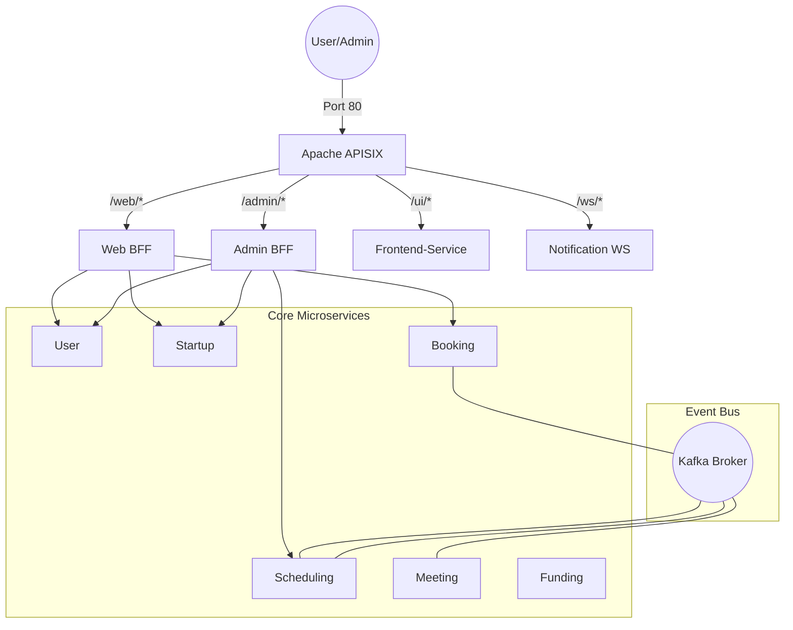

# Microservices Architecture: Pitch-Booking & Startup Ecosystem

Một hệ thống quản trị hệ sinh thái Startup và điều phối Pitching chuyên nghiệp, được xây dựng trên nền tảng **Microservices** tiên tiến, sử dụng **Django**, **Kafka**, **APISIX**, và kiến trúc **BFF**.


---

## 👥 Team Members

| Name | Student ID | Role | Contribution |
|------|------------|------|-------------|
| Phan Hoàng An  |         | ...  | ...         |
| Đỗ Đăng An  |         | ...  | ...         |
| Phạm Thành Hùng | B22DCAT139        | ...  | ...         |

---

## 📂 Project Structure

---

## 📁 Project Structure

```
microservices-assignment-starter/
├── README.md                       # This file — project overview
├── .env.example                    # Environment variable template
├── docker-compose.yml              # Multi-container orchestration
├── Makefile                        # Common development commands
│
├── docs/                           # 📖 Documentation
│   ├── analysis-and-design.md      # System analysis & service design
│   ├── architecture.md             # Architecture overview & diagrams
│   ├── asset/                      # Images, diagrams, visual assets
│   └── api-specs/                  # OpenAPI 3.0 specifications
│       ├── service-a.yaml
│       └── service-b.yaml
│
├── frontend/                       # 🖥️ Frontend application
│   ├── Dockerfile
│   ├── readme.md
│   └── src/
│
├── gateway/                        # 🚪 API Gateway / reverse proxy
│   ├── Dockerfile
│   ├── readme.md
│   └── src/
│
├── services/                       # ⚙️ Backend microservices
│   ├── service-a/
│   │   ├── Dockerfile
│   │   ├── readme.md
│   │   └── src/
│   └── service-b/
│       ├── Dockerfile
│       ├── readme.md
│       └── src/
│
├── scripts/                        # 🔧 Utility scripts
│   └── snyk-scan.sh
│
├── .ai/                            # 🤖 AI-assisted development
│   ├── AGENTS.md                   # Agent instructions (source of truth)
│   ├── vibe-coding-guide.md        # Hướng dẫn vibe coding
│   └── prompts/                    # Reusable prompt templates
│       ├── new-service.md
│       ├── api-endpoint.md
│       ├── create-dockerfile.md
│       ├── testing.md
│       └── debugging.md
│
├── .github/copilot-instructions.md # GitHub Copilot instructions
├── .cursorrules                    # Cursor AI instructions
├── .windsurfrules                  # Windsurf AI instructions
└── CLAUDE.md                       # Claude Code instructions
```

---

## 🚀 Getting Started

### Prerequisites
- Docker & Docker Compose
- Python 3.11+
- Git

### Quick Start

```bash
# 1. Clone this repository
git clone https://github.com/hungdn1701/microservices-assignment-starter.git
cd microservices-assignment-starter

```bat
# Trên Windows
start.bat

# Hoặc thủ công qua Docker
docker-compose up -d --build
```

### 3. Cấu hình Gateway (Bắt buộc)
Ngay sau khi các container đã chạy, bạn cần nạp các quy tắc điều hướng vào APISIX:
```bash
python setup_apisix_routes.py
```

### 4. Truy cập nhanh
- **Web App:** [http://localhost/ui/](http://localhost/ui/)
- **Bảng điều khiển APISIX:** [http://localhost:9000](http://localhost:9000) (`admin`/`password`)
- **API Admin (APISIX):** `http://localhost:9180`
- **Thống kê Prometheus:** `http://localhost:9091`

---

## 🏗️ Architecture

### Sơ đồ Điều hướng Request


---


## 🔄 Luồng Nghiệp vụ (Saga Pattern)

Dự án áp dụng **Saga Choreography** để đảm bảo tính nhất quán dữ liệu qua các service mà không cần dùng Distributed Transaction (2PC):

### 1. Luồng Đặt chỗ Pitching
1. **Booking Service**: Nhận yêu cầu -> Trạng thái `INITIALIZED` -> Bắn sự kiện `pitch_booking_initiated`.
2. **Scheduling Service**: Nhận thông tin -> Giữ chỗ (Reserve Slot) -> Bắn sự kiện `slot_confirmed`.
3. **Meeting Service**: Nhận tin -> Tạo phòng họp -> Bắn sự kiện `meeting_auto_created`.
4. **Booking Service**: Nhận tin cuối -> Chuyển trạng thái `CONFIRMED`.
*Nếu bất kỳ bước nào lỗi, hệ thống tự động bắn sự kiện bù đắp (Compensation) để giải phóng Slot.*

### 2. Luồng Đăng ký & Nâng cấp Founder
- Startup đăng ký -> Admin duyệt -> User Service tự động cập nhật Role lên `founder`.

---

## ⚙️ Cấu hình Môi trường (Environment Variables)

Các biến quan trọng trong `docker-compose.yml`:
- `KAFKA_BOOTSTRAP_SERVERS`: Địa chỉ kết nối Kafka (mặc định `kafka:9092`).
- `DB_HOST`: Địa chỉ Database PostgreSQL.
- `REDIS_HOST`: Địa chỉ cache Redis.
- Các URL Service (ví dụ: `USER_SERVICE_URL`) để các BFF có thể gọi đến.

---

## 🛠 Troubleshooting (Các vấn đề thường gặp)

**Q: Chạy file `setup_apisix_routes.py` bị lỗi connection?**
> A: Đảm bảo APISIX đã khởi động xong. Chờ khoảng 10-20 giây sau khi gõ `docker-compose up` rồi hãy chạy script.

**Q: Tại sao tôi không nhận được thông báo thời gian thực?**
> A: Kiểm tra xem `notification-service` và Kafka có chạy ổn định không. Đảm bảo cổng 80 của Gateway không bị chặn.

**Q: Làm sao để thêm một Microservice mới?**
> 1. Thêm service vào `docker-compose.yml`.
> 2. Cấu hình Upstream và Route mới trong `setup_apisix_routes.py`.

---


---

## 🤖 AI-Assisted Development (Vibe Coding)

This repo is pre-configured for **AI-powered development**. Each AI tool auto-loads its instruction file:

| Tool | Config File |
|------|-------------|
| GitHub Copilot | `.github/copilot-instructions.md` |
| Cursor | `.cursorrules` |
| Claude Code | `CLAUDE.md` |
| Windsurf | `.windsurfrules` |

All instruction files point to [`.ai/AGENTS.md`](.ai/AGENTS.md) as the single source of truth.
Ready-to-use prompt templates are in [`.ai/prompts/`](.ai/prompts/).

> 📖 Full guide (Vietnamese): [`.ai/vibe-coding-guide.md`](.ai/vibe-coding-guide.md)

---