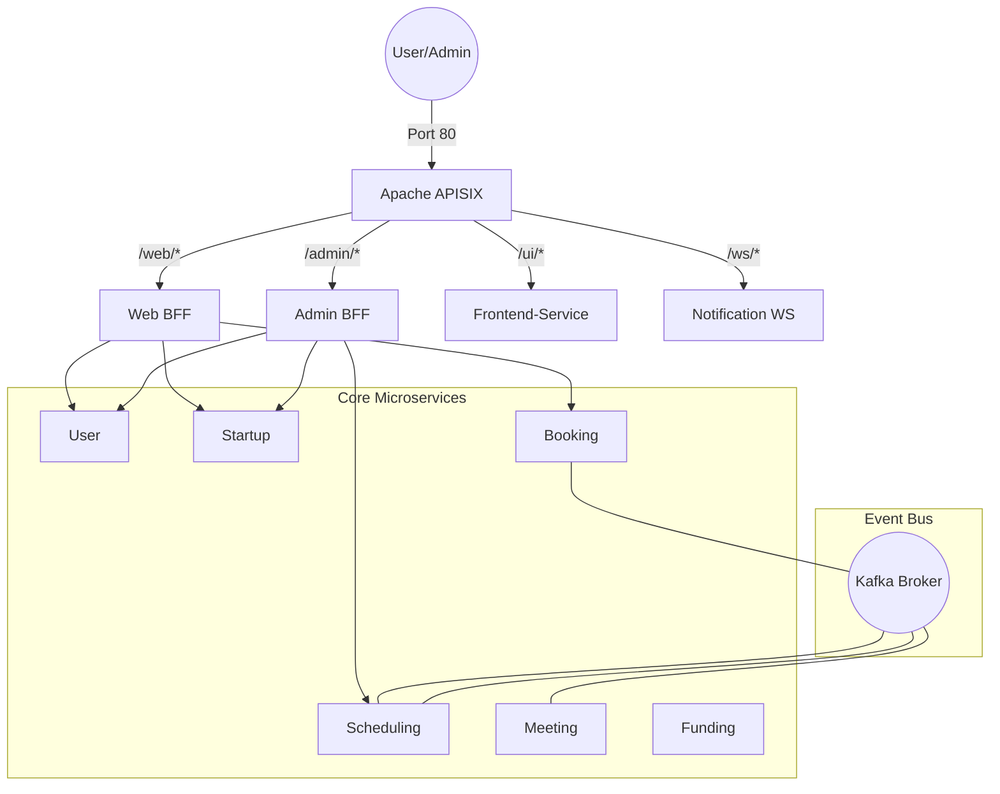

# Microservices Architecture: Pitch-Booking & Startup Ecosystem

> [!TIP]
> **Jira Tracking:** [SCRUM-1](https://andydo21.atlassian.net/browse/SCRUM-1) | [SCRUM-2](https://andydo21.atlassian.net/browse/SCRUM-2)

> [!IMPORTANT]
> **Quy trình chuyên nghiệp:** Để làm việc hiệu quả với Jira, hãy tham khảo [JIRA_WORKFLOW.md](file:///d:/Django_project/api-gateway_vs_bff/JIRA_WORKFLOW.md).

Một hệ thống quản trị hệ sinh thái Startup và điều phối Pitching chuyên nghiệp, được xây dựng trên nền tảng **Microservices** tiên tiến, sử dụng **Django**, **Kafka**, **APISIX**, và kiến trúc **BFF**.

---

## 🚀 Hướng dẫn Khởi động Nhanh

### 1. Yêu cầu Hệ thống
- Docker & Docker Compose
- Python 3.11+
- Git

### 2. Khởi động Toàn bộ Hệ thống
```bat
# Trên Windows
start.bat

# Hoặc thủ công qua Docker
docker-compose up -d --build
```

### 3. Cấu hình Gateway (Bắt buộc)
Ngay sau khi các container đã chạy, bạn cần nạp các quy tắc điều hướng vào APISIX:
```bash
python setup_apisix_routes.py
```

### 4. Truy cập nhanh
- **Web App:** [http://localhost/ui/](http://localhost/ui/)
- **Bảng điều khiển APISIX:** [http://localhost:9000](http://localhost:9000) (`admin`/`password`)
- **API Admin (APISIX):** `http://localhost:9180`
- **Thống kê Prometheus:** `http://localhost:9091`

---

## 🏗 Kiến trúc Tổng thể (Architecture)

### Sơ đồ Điều hướng Request


---

## 📂 Giải thích Cấu trúc Thư mục

```text
.
├── apisix_conf/            # Cấu hình APISIX & Dashboard
├── bff/                    # Lớp Backend for Frontend (BFF)
│   ├── web-bff/           # API tổng hợp cho người dùng cuối
│   └── admin-bff/         # API tổng hợp cho quản trị viên
├── microservices/          # Các dịch vụ hạt nhân (Core logic)
│   ├── user-service/      # Identity, Profile, Roles
│   ├── startup-service/   # Quy trình đăng ký & duyệt Startup
│   ├── scheduling-service/# Quản lý Slot & Availability
│   ├── booking-service/   # Quy trình Pitching Booking
│   ├── meeting-service/   # Tích hợp Zoom/Meet/Logic họp
│   ├── notification-service/ # WebSockets & Real-time Alerts
│   └── feedback-service/  # Đánh giá & Phản hồi sau pitch
├── frontend/               # Mã nguồn giao diện (HTML/JS/CSS)
├── frontend-service/      # Django UI Server (chỉ phục vụ file tĩnh)
├── scripts/                # Các script tiện ích, tạo data mẫu
├── docker-compose.yml      # File điều phối toàn bộ Docker
└── setup_apisix_routes.py  # Script cấu hình Route động
```

---

## 🔄 Luồng Nghiệp vụ (Saga Pattern)

Dự án áp dụng **Saga Choreography** để đảm bảo tính nhất quán dữ liệu qua các service mà không cần dùng Distributed Transaction (2PC):

### 1. Luồng Đặt chỗ Pitching
1. **Booking Service**: Nhận yêu cầu -> Trạng thái `INITIALIZED` -> Bắn sự kiện `pitch_booking_initiated`.
2. **Scheduling Service**: Nhận thông tin -> Giữ chỗ (Reserve Slot) -> Bắn sự kiện `slot_confirmed`.
3. **Meeting Service**: Nhận tin -> Tạo phòng họp -> Bắn sự kiện `meeting_auto_created`.
4. **Booking Service**: Nhận tin cuối -> Chuyển trạng thái `CONFIRMED`.
*Nếu bất kỳ bước nào lỗi, hệ thống tự động bắn sự kiện bù đắp (Compensation) để giải phóng Slot.*

### 2. Luồng Đăng ký & Nâng cấp Founder
- Startup đăng ký -> Admin duyệt -> User Service tự động cập nhật Role lên `founder`.

---

## ⚙️ Cấu hình Môi trường (Environment Variables)

Các biến quan trọng trong `docker-compose.yml`:
- `KAFKA_BOOTSTRAP_SERVERS`: Địa chỉ kết nối Kafka (mặc định `kafka:9092`).
- `DB_HOST`: Địa chỉ Database PostgreSQL.
- `REDIS_HOST`: Địa chỉ cache Redis.
- Các URL Service (ví dụ: `USER_SERVICE_URL`) để các BFF có thể gọi đến.

---

## 🛠 Troubleshooting (Các vấn đề thường gặp)

**Q: Chạy file `setup_apisix_routes.py` bị lỗi connection?**
> A: Đảm bảo APISIX đã khởi động xong. Chờ khoảng 10-20 giây sau khi gõ `docker-compose up` rồi hãy chạy script.

**Q: Tại sao tôi không nhận được thông báo thời gian thực?**
> A: Kiểm tra xem `notification-service` và Kafka có chạy ổn định không. Đảm bảo cổng 80 của Gateway không bị chặn.

**Q: Làm sao để thêm một Microservice mới?**
> 1. Thêm service vào `docker-compose.yml`.
> 2. Cấu hình Upstream và Route mới trong `setup_apisix_routes.py`.

---

## 📝 License & Author
- **Author:** Andy Do
- **License:** MIT
