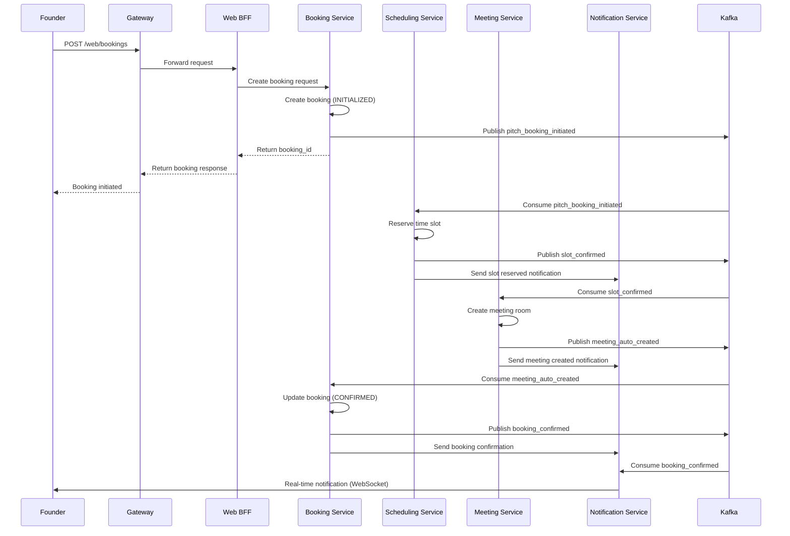
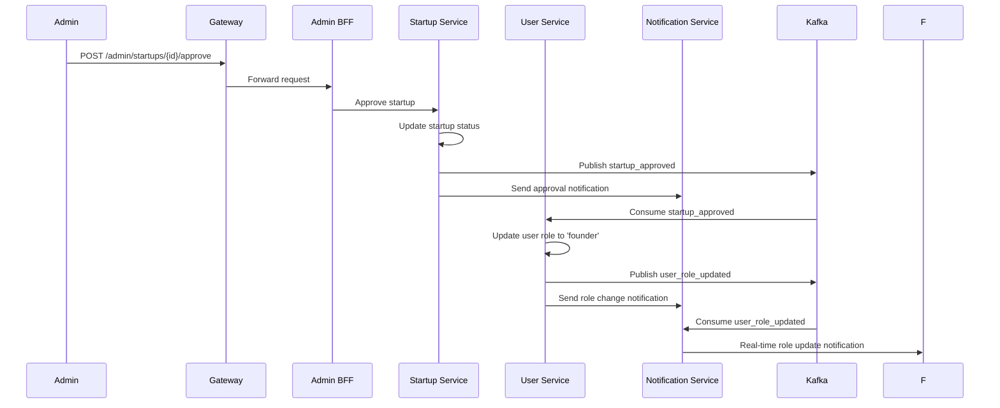

# 📊 Microservices System — Analysis and Design

This document outlines the business logic analysis and service-oriented design for a specific business process (use case) in the microservices-based system.

**References:**
1. *Service-Oriented Architecture: Analysis and Design for Services and Microservices* — Thomas Erl (2nd Edition)
2. *Microservices Patterns: With Examples in Java* — Chris Richardson
3. *Bài tập — Phát triển phần mềm hướng dịch vụ* — Hung DN (2024)

---

## 1. 🎯 Problem Statement

**Domain:** Startup Ecosystem Management & Pitch Booking Platform

**Problem:** Traditional startup-investor matching is inefficient, lacking centralized coordination for pitch sessions, real-time communication, and systematic feedback collection. Organizations struggle with managing multiple startups, investors, scheduling conflicts, and tracking engagement metrics.

**Users/Actors:**
- **Founders**: Startup owners seeking funding and exposure
- **Investors**: Individuals/companies looking for investment opportunities  
- **Administrators**: Platform managers overseeing the ecosystem
- **General Users**: Visitors browsing startups and attending pitches

**Scope:**
**Included:** Startup registration, investor profiles, pitch booking system, real-time notifications, feedback collection, resource management, matchmaking algorithms
**Excluded:** Financial transaction processing, legal document management, investment contract execution

---

## 2. 🧩 Service-Oriented Analysis

Analyze the business process to identify key functionalities and potential microservices.

### 2.1 Business Process Decomposition

| Step | Activity | Actor | Description |
|------|------------------------|----------|----------------------------------|
| 1 | User Registration | Founder/Investor | Create account with role selection |
| 2 | Startup Registration | Founder | Submit startup details for approval |
| 3 | Admin Approval | Administrator | Review and approve/reject startups |
| 4 | Profile Enhancement | Founder/Investor | Complete detailed profiles |
| 5 | Browse Startups | Investor | Discover and filter investment opportunities |
| 6 | Slot Availability Check | Founder | View available pitching time slots |
| 7 | Pitch Booking | Founder | Initiate booking request for specific slot |
| 8 | Booking Confirmation | System | Auto-confirm via saga orchestration |
| 9 | Meeting Room Allocation | System | Assign virtual/physical meeting room |
| 10 | Pitch Session | Founder/Investor | Conduct scheduled pitch meeting |
| 11 | Feedback Collection | Investor | Provide rating and comments |
| 12 | Notification Delivery | System | Send real-time updates to all parties |

### 2.2 Entity Identification

| Entity      | Attributes                     | Owned By      |
|-------------|--------------------------------|---------------|
| User        | id, username, email, role, phone, banned, created_at | User Service     |
| Startup     | id, company_name, description, industry, website, category_id, user_id, status, featured, created_at | Startup Service     |
| Category    | id, name, description, created_at | Startup Service     |
| Investor    | id, user_id, company_name, bio, interests, created_at | Startup Service     |
| Review      | id, startup_id, user_id, username, rating, comment, created_at | Startup Service     |
| TimeSlot    | id, start_time, end_time, available, room_id, created_at | Scheduling Service     |
| Booking     | id, startup_id, investor_id, slot_id, status, created_at | Booking Service     |
| Meeting     | id, booking_id, room_url, start_time, end_time, status | Meeting Service     |
| Feedback    | id, meeting_id, rating, comment, created_at | Feedback Service     |
| Notification| id, user_id, message, type, read, created_at | Notification Service     |
| UserOutboxEvent | id, event_type, payload, processed, created_at | User Service     |
| StartupOutboxEvent | id, event_type, payload, processed, created_at | Startup Service     |

### 2.3 Service Candidate Identification

Identify candidate services based on:
- **Business capability** decomposition
- **Domain-Driven Design** bounded contexts
- **Data ownership** boundaries

---

## 3. 🔄 Service-Oriented Design

### 3.1 Service Inventory

| Service | Responsibility | Type | Port |
|-------------|-----------------------------|---------------|------|
| User Service | User authentication, profiles, role management | Entity | 4001 |
| Startup Service | Startup registration, categories, reviews, investor profiles | Entity | 4002 |
| Scheduling Service | Time slot management, availability tracking | Entity | 4008 |
| Booking Service | Pitch booking orchestration, saga coordination | Task | 4009 |
| Meeting Service | Meeting room allocation, video conference integration | Entity | 4010 |
| Feedback Service | Feedback collection, rating aggregation | Entity | 4011 |
| Notification Service | Real-time notifications, event publishing | Utility | 4007 |
| Funding Service | Investment tracking, funding round management | Entity | 4004 |
| Resource Service | Physical resource management, equipment booking | Entity | 4005 |
| Matchmaking Service | Algorithm-based matching, recommendations | Task | 4006 |
| Web BFF | Frontend API aggregation, request routing | Utility | - |
| Admin BFF | Admin-specific API aggregation | Utility | 3002 |
| Gateway | API routing, load balancing, security | Utility | 80 |

### 3.2 Service Capabilities (Interface Design)

**User Service:**
| Capability | Method | Endpoint | Input | Output |
|---------------------|--------|-----------------|--------------------|--------------------|
| Register user | POST | `/users/register` | UserCreate body | User |
| Login user | POST | `/users/login` | Login credentials | JWT tokens |
| Get user profile | GET | `/users/{id}` | user_id | User |
| Update user role | PATCH | `/users/{id}/role` | role_update | User |
| List users | GET | `/users/` | query params | User[] |

**Startup Service:**
| Capability | Method | Endpoint | Input | Output |
|---------------------|--------|-----------------|--------------------|--------------------|
| Create startup | POST | `/startups/` | StartupCreate body | Startup |
| List startups | GET | `/startups/` | filters, pagination | Startup[] |
| Approve startup | PATCH | `/startups/{id}/approve` | approval_data | Startup |
| Add review | POST | `/startups/{id}/reviews` | ReviewCreate body | Review |
| List categories | GET | `/categories/` | - | Category[] |

**Booking Service:**
| Capability | Method | Endpoint | Input | Output |
|---------------------|--------|-----------------|--------------------|--------------------|
| Create booking | POST | `/bookings/` | BookingCreate body | Booking |
| Get booking status | GET | `/bookings/{id}` | booking_id | Booking |
| Cancel booking | PATCH | `/bookings/{id}/cancel` | - | Booking |
| List user bookings | GET | `/bookings/user/{user_id}` | user_id | Booking[] |

**Scheduling Service:**
| Capability | Method | Endpoint | Input | Output |
|---------------------|--------|-----------------|--------------------|--------------------|
| Create time slot | POST | `/slots/` | SlotCreate body | TimeSlot |
| List available slots | GET | `/slots/available` | date_range | TimeSlot[] |
| Reserve slot | PATCH | `/slots/{id}/reserve` | booking_id | TimeSlot |
| Release slot | PATCH | `/slots/{id}/release` | - | TimeSlot |

### 3.3 Service Interactions

**Pitch Booking Saga Flow:**



**User Role Update Flow:**



### 3.4 Data Ownership & Boundaries

| Data Entity | Owner Service | Access Pattern          |
|-------------|---------------|-------------------------|
| User | User Service | CRUD via REST API |
| UserOutboxEvent | User Service | Internal processing, Kafka publishing |
| Startup | Startup Service | CRUD via REST API |
| Category | Startup Service | CRUD via REST API |
| Investor | Startup Service | CRUD via REST API |
| Review | Startup Service | CRUD via REST API |
| StartupOutboxEvent | Startup Service | Internal processing, Kafka publishing |
| TimeSlot | Scheduling Service | CRUD via REST API, event-driven updates |
| Booking | Booking Service | CRUD via REST API, saga orchestration |
| Meeting | Meeting Service | CRUD via REST API, event-driven creation |
| Feedback | Feedback Service | CRUD via REST API |
| Notification | Notification Service | CRUD via REST API, WebSocket delivery |
| Resource | Resource Service | CRUD via REST API |
| Funding | Funding Service | CRUD via REST API |

**Cross-Service Data Access:**
- **User Service** → **Startup Service**: Read startup data for user profiles via REST API
- **Startup Service** → **User Service**: Update user roles via events (startup_approved)
- **Booking Service** → **User Service**: Read user data for booking validation via REST API
- **Booking Service** → **Startup Service**: Read startup data for booking validation via REST API
- **All Services** → **Notification Service**: Send notifications via events/API

---

## 4. 📋 API Specifications

Complete API definitions are in:
- [`docs/api-specs/service-a.yaml`](api-specs/service-a.yaml)
- [`docs/api-specs/service-b.yaml`](api-specs/service-b.yaml)

---

## 5. 🗄️ Data Model

### User Service — Data Model

```
┌─────────────────────────────────────┐
│                User                 │
├─────────────────────────────────────┤
│ id: Integer (PK)                   │
│ username: String (unique)           │
│ email: String (unique)             │
│ first_name: String                  │
│ last_name: String                   │
│ phone: String                       │
│ role: Enum (admin/investor/founder/user) │
│ banned: Boolean                     │
│ created_at: DateTime                │
│ updated_at: DateTime                │
└─────────────────────────────────────┘

┌─────────────────────────────────────┐
│          UserOutboxEvent            │
├─────────────────────────────────────┤
│ id: Integer (PK)                    │
│ event_type: String                  │
│ payload: JSONField                  │
│ created_at: DateTime                │
│ processed: Boolean                  │
│ processed_at: DateTime (nullable)   │
└─────────────────────────────────────┘

### Notification Service — Data Model

┌─────────────────────────────────────┐
│            Notification             │
├─────────────────────────────────────┤
│ id: Integer (PK)                    │
│ user_id: Integer (FK)               │
│ message: Text                       │
│ type: String                        │
│ read: Boolean                       │
│ created_at: DateTime                │
└─────────────────────────────────────┘

---

## 6. ❗ Non-Functional Requirements

| Requirement | Description |
|-------------|-------------|
| **Performance** | API response time < 200ms for 95% of requests, < 500ms for 99% |
| **Scalability** | Support 1000+ concurrent users, horizontal scaling of individual services |
| **Availability** | 99.9% uptime with graceful degradation and automatic recovery |
| **Security** | JWT authentication, HTTPS encryption, input validation, rate limiting |
| **Data Consistency** | Eventual consistency across services via Saga pattern with compensation |
| **Fault Tolerance** | Circuit breakers, retry mechanisms, dead letter queues for failed events |
| **Monitoring** | Comprehensive health checks, metrics collection via Prometheus, distributed tracing |
| **Real-time Communication** | WebSocket notifications with < 100ms latency |
| **Data Privacy** | GDPR compliance, encrypted sensitive data, audit logging |
| **Deployability** | Single-command deployment via Docker Compose, rolling updates |