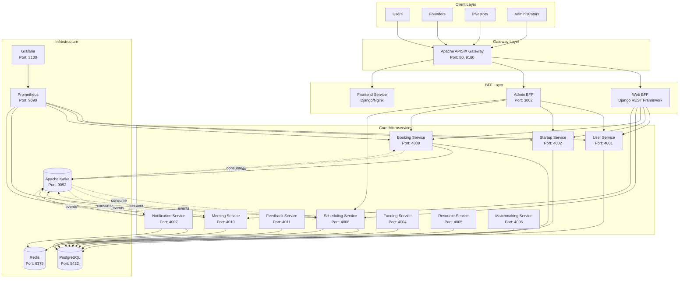

# 🏗️ System Architecture

## 1. Overview

The **Startup Ecosystem Management Platform** is a comprehensive microservices-based system designed to facilitate efficient startup-investor matching, pitch booking coordination, and ecosystem management.

**Problem Solved**: Traditional startup funding processes are fragmented, lacking centralized coordination for pitch sessions, real-time communication, and systematic feedback collection. The platform provides a unified solution for managing the entire startup lifecycle from registration to funding.

**Target Users**:
- **Founders**: Startup owners seeking funding and mentorship opportunities
- **Investors**: Individuals and companies looking for investment opportunities
- **Administrators**: Platform managers overseeing ecosystem health and compliance
- **General Users**: Visitors browsing startups and attending public pitch events

**Key Quality Attributes**:
- **Scalability**: Horizontal scaling to support growing startup and investor communities
- **Reliability**: 99.9% uptime with fault-tolerant design patterns
- **Performance**: Sub-200ms API response times for optimal user experience
- **Security**: Enterprise-grade authentication and data protection
- **Maintainability**: Modular architecture enabling independent service development and deployment

## 2. Architecture Style

The system employs multiple architectural patterns to achieve scalability, reliability, and maintainability:

- [x] **Microservices**: Decomposed into 13 independent services based on business domains
- [x] **API Gateway pattern**: Apache APISIX provides unified entry point with routing, authentication, and rate limiting
- [x] **Event-driven / Message queue**: Kafka-based asynchronous communication for eventual consistency
- [x] **Database per service**: Each service owns its database schema for loose coupling
- [x] **Saga pattern**: Choreography-based saga for distributed transactions (pitch booking flow)
- [x] **BFF (Backend for Frontend) pattern**: Separate BFFs for web and admin interfaces
- [x] **Outbox pattern**: Reliable event publishing with transactional outbox tables

## 3. System Components

| Component | Responsibility | Tech Stack | Port |
|-----------|----------------|------------|------|
| **Frontend Service** | UI server, static asset serving | Django/Nginx | - |
| **Apache APISIX Gateway** | API routing, auth, rate limiting, load balancing | Apache APISIX | 80, 9180 |
| **Web BFF** | Frontend API aggregation, request orchestration | Django REST Framework | - |
| **Admin BFF** | Admin-specific API aggregation, enhanced permissions | Django REST Framework | 3002 |
| **User Service** | User authentication, profiles, role management | Django, PostgreSQL | 4001 |
| **Startup Service** | Startup registration, categories, reviews, investor profiles | Django, PostgreSQL | 4002 |
| **Scheduling Service** | Time slot management, availability tracking | Django, PostgreSQL, Redis | 4008 |
| **Booking Service** | Pitch booking orchestration, saga coordination | Django, PostgreSQL, Kafka | 4009 |
| **Meeting Service** | Meeting room allocation, video conference integration | Django, PostgreSQL | 4010 |
| **Feedback Service** | Feedback collection, rating aggregation | Django, PostgreSQL | 4011 |
| **Notification Service** | Real-time notifications, event publishing, WebSocket | Django, PostgreSQL, Redis, Kafka | 4007 |
| **Funding Service** | Investment tracking, funding round management | Django, PostgreSQL | 4004 |
| **Resource Service** | Physical resource management, equipment booking | Django, PostgreSQL | 4005 |
| **Matchmaking Service** | Algorithm-based matching, recommendations | Django, PostgreSQL | 4006 |
| **PostgreSQL** | Primary relational database for all services | PostgreSQL 15 | 5432 |
| **Kafka** | Event streaming, message broker | Apache Kafka | 9092 |
| **Redis** | Caching, session storage, pub/sub | Redis 7 | 6379 |
| **Prometheus** | Metrics collection, monitoring | Prometheus | 9090 |
| **Grafana** | Visualization, dashboards | Grafana | 3100 |

## 4. Communication Patterns

The system uses a hybrid communication approach combining synchronous and asynchronous patterns:

**Synchronous Communication**:
- **REST APIs**: Primary communication pattern between BFFs and core services
- **HTTP/JSON**: Standard protocol for request-response interactions
- **Service Discovery**: Docker Compose internal DNS for service resolution

**Asynchronous Communication**:
- **Apache Kafka**: Event-driven communication for eventual consistency
- **WebSocket**: Real-time notifications from Notification Service to clients
- **Redis Pub/Sub**: Lightweight pub/sub for caching invalidation

### Inter-service Communication Matrix

| From → To | User Service | Startup Service | Booking Service | Scheduling Service | Meeting Service | Notification Service | Gateway |
|-----------|--------------|-----------------|-----------------|-------------------|------------------|---------------------|---------|
| **Frontend** | - | - | - | - | - | WebSocket | REST |
| **Web BFF** | REST | REST | REST | REST | REST | REST | - |
| **Admin BFF** | REST | REST | REST | REST | REST | REST | - |
| **Gateway** | REST | REST | REST | REST | REST | REST | - |
| **Booking Service** | REST (validation) | REST (validation) | - | REST (reserve) | Events | Events | - |
| **Scheduling Service** | - | - | REST (confirm) | - | Events | Events | - |
| **Meeting Service** | - | - | REST (create) | - | - | Events | - |
| **Startup Service** | Events (role update) | - | - | - | - | Events | - |
| **User Service** | - | Events (user created) | - | - | - | Events | - |
| **Notification Service** | - | - | Events | Events | Events | - | - |

**Event Topics (Kafka)**:
- `pitch_booking_initiated`
- `slot_confirmed` 
- `meeting_auto_created`
- `booking_confirmed`
- `startup_approved`
- `user_role_updated`
- `notification_events`

## 5. Data Flow

The system handles multiple request patterns depending on the use case:

**Typical User Request Flow**:
```
User → Frontend → APISIX Gateway → Web BFF → Core Service(s) → PostgreSQL
                                        ↓
                                    Kafka Events → Notification Service → WebSocket → User
```

**Pitch Booking Saga Flow**:
```
Founder → Frontend → Gateway → Web BFF → Booking Service (INITIALIZED)
                         ↓
                    Kafka: pitch_booking_initiated
                         ↓
    Scheduling Service (reserve slot) → Kafka: slot_confirmed
                         ↓
    Meeting Service (create meeting) → Kafka: meeting_auto_created  
                         ↓
    Booking Service (confirm) → Kafka: booking_confirmed
                         ↓
    Notification Service → Real-time WebSocket to all participants
```

**Admin Approval Flow**:
```
Admin → Frontend → Gateway → Admin BFF → Startup Service (approve)
                         ↓
                    Kafka: startup_approved
                         ↓
    User Service (update role to 'founder') → Kafka: user_role_updated
                         ↓
    Notification Service → Role change notification
```

**Real-time Notification Flow**:
```
Any Service → Kafka Event → Notification Service → WebSocket → Connected Clients
```

## 6. Architecture Diagram



**Key Architecture Patterns Illustrated:**
1. **API Gateway Pattern**: Single entry point through APISIX
2. **BFF Pattern**: Separate backend-for-frontend services
3. **Microservices**: Independent, domain-specific services
4. **Event-Driven**: Kafka for asynchronous communication
5. **Database per Service**: Each service owns its data
6. **Saga Pattern**: Distributed transaction coordination via events

## 7. Deployment

**Containerization Strategy**:
- All services containerized with multi-stage Docker builds for optimized images
- Health checks implemented for all services (HTTP endpoints and database connectivity)
- Environment-based configuration via Docker environment variables

**Orchestration**:
- **Docker Compose**: Development and small-scale production deployments
- **Service Dependencies**: Proper startup ordering with `depends_on` and health checks
- **Network Isolation**: Internal Docker network for secure service communication
- **Volume Management**: Persistent data volumes for PostgreSQL and Redis

**Infrastructure Components**:
- **PostgreSQL**: Single instance with persistent volume for all service databases
- **Kafka Cluster**: Single broker with Zookeeper for development
- **Redis**: Single instance with persistence for caching and sessions
- **Monitoring Stack**: Prometheus + Grafana for observability

**Deployment Commands**:
```bash
# Start all services
docker-compose up -d --build

# Initialize API Gateway routes
python setup_apisix_routes.py

# View logs
docker-compose logs -f [service-name]

# Stop all services  
docker-compose down
```

**Environment Configuration**:
- Database connections via `DB_HOST=postgres`
- Kafka bootstrap servers via `KAFKA_BOOTSTRAP_SERVERS=kafka:9092`
- Redis cache via `REDIS_HOST=redis`
- Service-to-service communication via internal DNS

## 8. Scalability & Fault Tolerance

**Independent Service Scaling**:
- **Horizontal Scaling**: Each service can be scaled independently via `docker-compose up --scale service-name=N`
- **Resource Allocation**: CPU and memory limits defined per service
- **Load Distribution**: APISIX Gateway provides round-robin load balancing
- **Stateless Services**: All business services designed as stateless for easy scaling

**Service Failure Handling**:
- **Graceful Degradation**: Services continue operating with reduced functionality when dependencies fail
- **Circuit Breakers**: Implement retry logic with exponential backoff for inter-service calls
- **Timeout Handling**: Configurable timeouts for all external service calls
- **Health Monitoring**: Continuous health checks with automatic service restart

**Data Consistency Mechanisms**:
- **Saga Pattern**: Distributed transactions orchestrated via Kafka events with compensation
- **Outbox Pattern**: Reliable event publishing with transactional guarantees
- **Eventual Consistency**: Services eventually converge to consistent state via events
- **Idempotency**: All event handlers designed to be idempotent for safe retries

**Fault Recovery Strategies**:
- **Automatic Recovery**: Docker Compose automatically restarts failed services
- **Dead Letter Queues**: Failed Kafka events routed to DLQ for manual processing
- **Database Recovery**: Point-in-time recovery capabilities with PostgreSQL WAL
- **Cache Recovery**: Redis persistence ensures cache survives restarts

**Monitoring & Alerting**:
- **Health Checks**: HTTP endpoints for all services (`/health/`)
- **Metrics Collection**: Prometheus metrics for request latency, error rates, throughput
- **Distributed Tracing**: Request correlation IDs for end-to-end tracing
- **Alerting**: Grafana dashboards for system health and performance monitoring

**High Availability Features**:
- **Redundant Components**: Multiple replicas for critical services (Web BFF: 2 replicas)
- **Database Resilience**: PostgreSQL with connection pooling and failover support
- **Message Queue Durability**: Kafka topics with replication factor for data durability
- **Session Replication**: Redis cluster for session state management