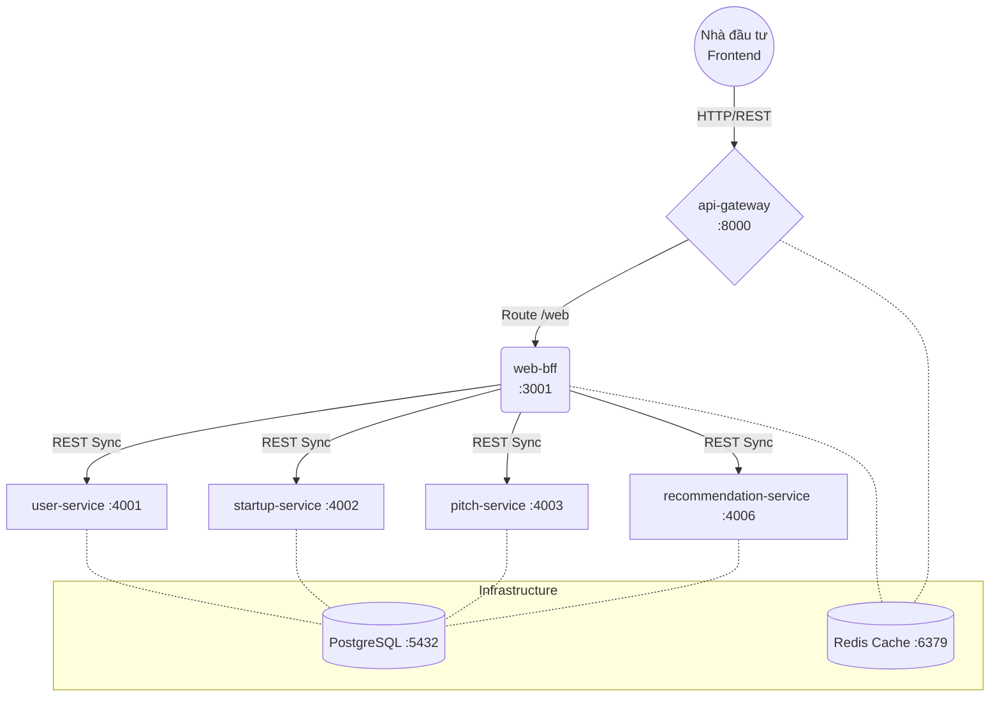

# BÁO CÁO KỸ THUẬT: TRIỂN KHAI HỆ THỐNG STARTUP HUB (MICROSERVICES + API GATEWAY + B.F.F)

Dự án này là quá trình chuyển đổi một hệ thống E-commerce truyền thống thành một nền tảng đầu tư Startup (**Startup Hub**). Kiến trúc của dự án sử dụng mô hình **API Gateway** kết hợp với **BFF (Backend for Frontend)** nhằm tối ưu hóa giao diện cho nhà đầu tư (Investor) và quản trị viên.

---

## 1. Các Nguyên Tắc Thiết Kế Chủ Đạo

### 1.1. Trách nhiệm Đơn nhất (Single Responsibility)
Mỗi dịch vụ đảm nhận một miền (domain) duy nhất. Ví dụ, `startup-service` (trước là product-service) chỉ quản lý dữ liệu về các dự án khởi nghiệp, trong khi `order-service` (nay xử lý Pitch Requests) quản lý các yêu cầu quan tâm từ nhà đầu tư.

### 1.2. Cơ sở dữ liệu riêng cho mỗi Dịch vụ (Database per Service)
Đảm bảo sự liên kết lỏng lẻo (loose coupling). Các dịch vụ không truy cập trực tiếp DB của nhau. `order-service` quản lý bảng `pitch_requests` và `pitch_items`, trong khi `startup-service` quản lý bảng `api_startup`.

### 1.3. Thiết kế theo Hướng Miền (Domain-Driven Design - DDD)

| Ngữ cảnh Giới hạn (Bounded Context) | Microservice thực tế | Trách nhiệm chính |
| :--- | :--- | :--- |
| **Định danh (Identity)** | `user-service` | Quản lý người dùng, phân quyền Investor. |
| **Dự án (Startup)** | `startup-service` | Quản lý vòng đời dự án Startup, danh mục dự án. |
| **Giao dịch (Pitching)** | `order-service` | Quản lý danh sách Pitch quan tâm (Pitch Requests). |
| **Trí tuệ (Intelligence)** | `recommendation-service` | Gợi ý Startup tiềm năng dựa trên tương tác (Add to Pitch). |

---

## 2. Mô Hình B.F.F (Backend for Frontend)

Dự án áp dụng mô hình **BFF** để gộp dữ liệu từ nhiều microservices trước khi trả về cho client. 

**Ví dụ:** Khi Investor xem trang chi tiết Startup:
1. `web-bff` gọi `startup-service` lấy thông tin dự án.
2. `web-bff` gọi `startup-service` lấy đánh giá (reviews).
3. `web-bff` gọi `recommendation-service` lấy các Startup tương tự.
4. Gộp toàn bộ thành một JSON duy nhất trả về Web Frontend.

---

## 3. Sơ Đồ Kiến Trúc Hệ Thống

---

## 4. Kết Luận

Việc tái cấu trúc từ "Cart" sang "Pitch Request" và "Product" sang "Startup" không chỉ là thay đổi nhãn (label) mà là một sự thay đổi về tư duy nghiệp vụ. Hệ thống hiện tại đã sẵn sàng để vận hành như một nền tảng kết nối Startup và Nhà đầu tư chuyên nghiệp với kiến trúc Microservices chuẩn công nghiệp.
